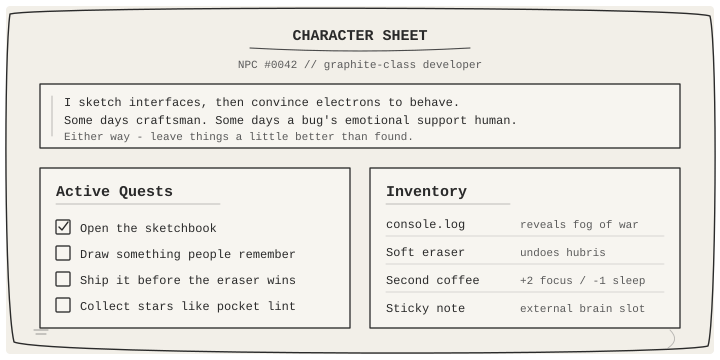
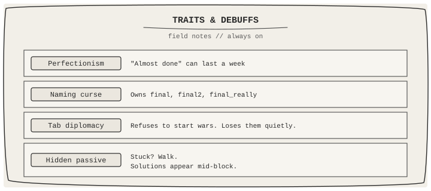
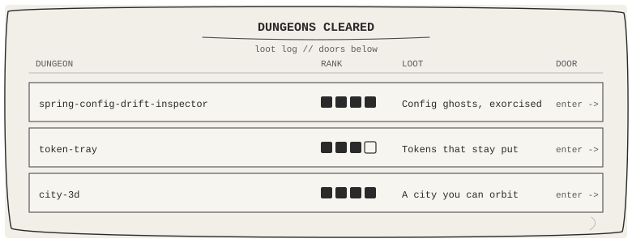

<!--
  Concept: Pencil-sketch NPC developer (A+B: character + terminal)
  Palette: graphite mono / sketchbook paper
  Profile: max · maxmode-now
-->

<div align="center">
  
  <br/>
  
</div>

<br/>

<div align="center">

# max
### *NPC #0042 · Graphite-class Developer*

`species` caffeine-based lifeform &nbsp;·&nbsp; `alignment` chaotic helpful &nbsp;·&nbsp; `guild` GitHub

</div>

<div align="center">
  
</div>

### Character Sheet

<div align="center">
  
</div>

<div align="center">
  
</div>

### Skill Tree *(hand-inked)*

<div align="center">
  
</div>

`TypeScript` · `React` · `Next.js` · `Node` · `HTML/CSS` · `Git`

### Traits &amp; Debuffs

<div align="center">
  
</div>

<div align="center">
  
</div>

### Dungeons Cleared

<div align="center">
  
  <br/>
  <sub>
    <a href="https://github.com/maxmode-now/spring-config-drift-inspector">enter · spring-config-drift-inspector</a>
    &nbsp;·&nbsp;
    <a href="https://github.com/maxmode-now/token-tray">enter · token-tray</a>
    &nbsp;·&nbsp;
    <a href="https://github.com/maxmode-now/city-3d">enter · city-3d</a>
  </sub>
</div>

<div align="center">
  
</div>

### Signals

<div align="center">

[](https://github.com/maxmode-now)
[](mailto:maxmode.now@gmail.com)
[](https://maxmode-now.com/)

</div>

<div align="center">
  
</div>

<div align="center">

**“Perfect code doesn't exist — only tomorrow's refactor does.”**

<sub>This NPC responds to issues &amp; PRs · coffee optional · kindness required</sub>

<br/><br/>

```text
$ echo "thanks for visiting the sketchbook"
thanks for visiting the sketchbook
$ _
```


</div>
