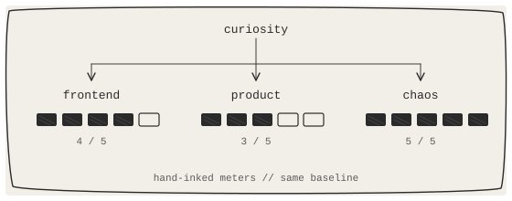

<!--
  Concept: Pencil-sketch NPC developer (A+B: character + terminal)
  Palette: graphite mono / sketchbook paper
  Profile: max · maxmode-now
-->

<div align="center">
  
  <br/>
  
</div>

<br/>

<div align="center">

# max
### *NPC #0042 · Graphite-class Developer*

`species` caffeine-based lifeform &nbsp;·&nbsp; `alignment` chaotic helpful &nbsp;·&nbsp; `guild` GitHub

</div>

<div align="center">
  
</div>

### Character Sheet

> I sketch interfaces, then convince electrons to behave.  
> Some days I'm a craftsman. Some days I'm a bug's emotional support human.  
> Either way — I leave things a little better than I found them.

<table>
  <tr>
    <td width="50%" valign="top">

**Active Quests**
- [x] Open the sketchbook
- [ ] Draw something people remember
- [ ] Ship it before the eraser wins
- [ ] Collect stars like pocket lint

    </td>
    <td width="50%" valign="top">

**Inventory**
| Item | Effect |
|:---|:---|
| `console.log` | Reveals fog of war |
| Soft eraser | Undoes hubris |
| Second coffee | +2 focus / −1 sleep |
| Sticky note | External brain slot |

    </td>
  </tr>
</table>

<div align="center">
  
</div>

### Skill Tree *(hand-inked)*

<div align="center">
  
</div>

`TypeScript` · `React` · `Next.js` · `Node` · `HTML/CSS` · `Git`

<details>
<summary><strong>Traits &amp; debuffs</strong> <sub>(click)</sub></summary>
<br/>

| Trait | Notes |
|:---|:---|
| Perfectionism | “Almost done” can last a week |
| Naming curse | Owns `final`, `final2`, `final_really` |
| Tab diplomacy | Refuses to start wars. Loses them quietly. |
| Hidden passive | Stuck? Walk. Solutions appear mid-block. |

</details>

<div align="center">
  
</div>

### Dungeons Cleared

| Dungeon | Rank | Loot | Door |
|:---|:---:|:---|:---|
| **spring-config-drift-inspector** | ★★★★ | Config ghosts, exorcised | [enter](https://github.com/maxmode-now/spring-config-drift-inspector) |
| **token-tray** | ★★★☆ | Tokens that stay put | [enter](https://github.com/maxmode-now/token-tray) |
| **city-3d** | ★★★★ | A city you can orbit | [enter](https://github.com/maxmode-now/city-3d) |

<div align="center">
  
</div>

### Signals

<div align="center">

[](https://github.com/maxmode-now)
[](mailto:maxmode.now@gmail.com)
[](https://maxmode-now.com/)

</div>

<div align="center">
  
</div>

<div align="center">

**“Perfect code doesn't exist — only tomorrow's refactor does.”**

<sub>This NPC responds to issues &amp; PRs · coffee optional · kindness required</sub>

<br/><br/>

```text
$ echo "thanks for visiting the sketchbook"
thanks for visiting the sketchbook
$ _
```


</div>
